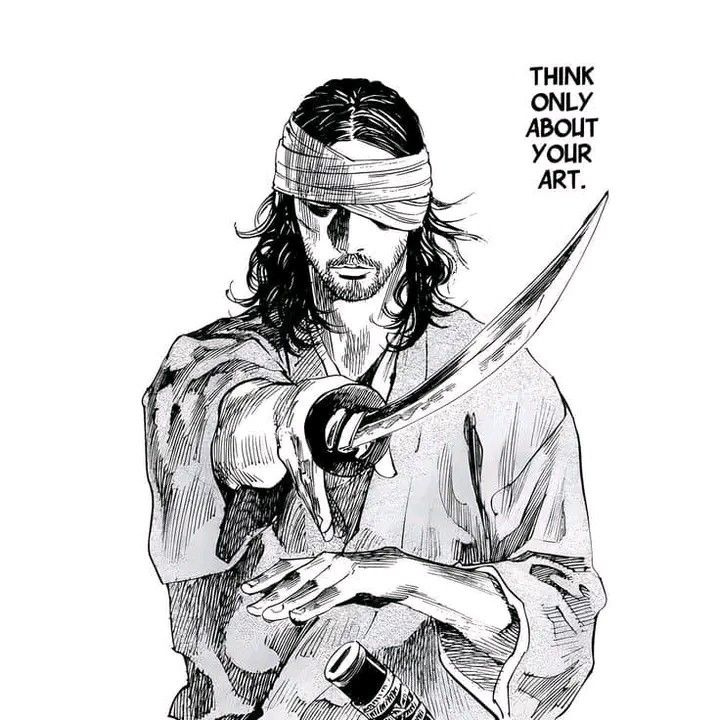

## 前言
所有修考同学都应该知道的开源过去问答案网站：[The Kai Project](https://runjp.com/)  

我是22届本科毕业的，毕业之后到北京敲了一年半的代码，在24年初辞职之后决定参加日本修考，在修考大军中应该算是大龄。我本科不是CS科班并且也没怎么认真学习过，所以基本上算是从0开始，再加上初期的信息闭塞，导致我的备考时间线拉的很长，同时备考的时间利用效率也比较低，不过也算是按照自己的计划一步一步地执行，在最后达成目标了。  
本文会详细地以我整个备考的时间线来写，包括择校、各个科目的备考也放在对应的时间中，相比于经验贴，其实更算对自己修考之路的记录和总结，另外，我会把自己的九大H26-R07的手写答案链接放在文末（专业课是信息论+自动机）需要的同学可以直接下载，正确率应该还可以。
## BG
+ 学校：江苏大学（双非）
+ 专业：通信工程
+ 绩点：2.72/5 - 均分77.2
+ 科研：0
+ 工作经验：2年（实习半年），Golang后端开发
+ 日语：N2
+ 英语：托业 - 775
+ 语校：25年7月
+ 无中介、无塾 （全靠gpt老师和gemini老师）
## Time Line
### 24.1-24.5 离职、修考启蒙
我是1月下旬辞职的，在爽玩了一个多月的碧蓝幻想Relink后最开始其实是准备的国内考研，当时2月份刚过完了C语言，然后就在三月偶然刷到了b站椎名伊司的修考视频，这个算是我的修考启蒙，在这之前我属于对留学想都没想过（毕竟我那届是叮咚鸡时代，整个专业只有一个人留学）。之后就边准备国内的数学、408边刷日本修考的信息，在看了很多大佬的经验贴之后于五一节下定决心转头准备修考并和父母表明。 

为什么选择修考：同样的努力在国内和日本修考可以考上的院校可以说完全不是一个级别，修考不是只有一次机会，每个院校都是一次机会。  
### 24.5-24.12 语校、日语、托业
在决定修考之后我申请了25年4月的语校，因为我这里是使馆高危地区签证必须要有在职税单（如果能解决签证的话，千万别来语校，又浪费时间又浪费钱）。  

五一之后我就开始跟着b站的阿飞老师自学日语，这个时候我还没有加任何修考的交流群，其实现在看来完全是上当了，花了太多时间在日语上面了（我是直接把目标放在第二年的夏入的，现在回头看应该在冬入就直接尝试的）。我跟着阿飞老师过完了新标日初级上下册和中级上的一半，刷了刷真题再加上十年老二刺猿的日语基础在12月考了N2（120）。同时在9.22考了托业，托业我用的是国版7套的一套题准备的 后面才知道这套题比真题要简单，不过我有接近6年没怎么学过英语了，能有775分也算是够用（六级482）。
### 24.12.1-24.12.10 信息整理、择校
在考完N2后我加了几个修考的交流大群，我不怎么水群，不过群里的信息确实很有帮助，特别是群文件里有着几乎所有科目的修考教科书电子版（在整个修考过程我一个教科书没买，全靠蹭群里的电子版）。 

在沿着排名翻学校官网和募集要项后，我决定了目标是做题家严选的京阪九三件套，京大、阪大、九大都是只需要拼笔试的学校，出愿也不需要内诺，并且九大和京大有全完的英语试题 九大情理和京大知能的科目重合程度也很高，可以说是对留学生绝对友好了（京阪撞车、九大新加psd系统是后话了）。
### 24.12.10-25.1.5 微积分
-关于修考的准备，我的整体思路是全程用公开课来准备，再用教科书强化一遍，最后刷过去问。这种上大课的方式很花费时间，不过对于我这种几乎算是0基础的来说可以很好地打牢基础。遇到不懂的地方的时候就直接和Gemini老师PK。  

[MIT18.01 Single Variable Calculus]("https://ocw.mit.edu/courses/18-01sc-single-variable-calculus-fall-2010")，这门课的内容只包含单元微积分，算是最基础的高数知识，所以内容难度也比较低，不过教授讲得非常好，上完后对于微积分的理解可以很透彻。
### 25.1.6-25.1.30 多元微积分、向量解析
[MIT18.02 Multivariable Calculus](https://ocw.mit.edu/courses/18-02sc-multivariable-calculus-fall-2010/)，这门课的主要内容是向量解析，可以完全覆盖九大的向量解析，同时二重积分、三重积分、微分也都有讲解，内容比18.01要多一点。
### 25.2.1-25.2.18 线性代数
线性代数不用多说，必须是大名鼎鼎的[MIT18.06 Linear Algebra](https://ocw.mit.edu/courses/18-06sc-linear-algebra-fall-2011/)，这门课基本上对于修考需要的知识点都可以覆盖（虽然还达不到上手写真题的难度）。这门课的笔记在写过去问的时候我翻了无数遍，遇到不懂地方也可以直接翻*Introduction to Linear Algebra*这本教科书。这里我开始用番茄钟了，这门课总花费大概69个小时。

京大和九大的线代很多时候考的都是证明题，这些题目要想稳拿分还是得要刷小黄书？不过我没刷小黄书这里就不讲了。另外九大去年和今年的线代难度骤降，都是考比较基础的知识点。
### 25.2.27-25.3.12 离散数学
[MIT_6.042J Mathematics for Computer Science](https://ocw.mit.edu/courses/6-042j-mathematics-for-computer-science-fall-2010/)，因为本来是准备考版大的，所以我也有打算学离散。这门课的内容分为算法分析、图论、数论、概率论四个部分，概率的部分我没有学。不过这门课的难度有点太高了，特别是数论的部分，再加上最后京版撞车后我就彻底放弃了离散。这门课最后对于我来说有价值的只有算法分析中的递归分析、时间复杂度和图论基础知识点（对后面学图算法有点帮助），算是浪费了十几天的时间吧，总花费40个小时。

这个时候因为感觉我准备的进度完全不够，所以联系了语校将入学时间推到了7月份。
### 25.3.13-4.9 算法
[MIT6.006 Introduction To Algorithms](https://ocw.mit.edu/courses/6-006-introduction-to-algorithms-spring-2020/pages/syllabus/)，这是MIT的算法大课，含金量满满，课程的教科书是CLRS。在之前我是刷过一些力扣、学过一些数据结构，不过算法没有系统地学习过。不想嗯啃CLRS的话还是比较推荐的 虽然比较花时间。  

这门课主要分为set+sequence(排序、哈希那些)、二叉树、图算法、DP四个大块，都讲的特别好，特别是DP的部分，讲了SRTBOT的方法，无敌。不过需要看得懂Python，课程的Recitations里的Python代码可以很好地帮助理解，不懂的地方也可以直接翻CLRS或是和Gemini老师掰头。不过也有一些没有覆盖到的算法，在刷题的时候补上就行 比如kmp、快排。

这门课花费了我接近一个月，总时间为132小时，不过还是非常值得的。
### 25.4.10-25.4.22 陶瓷、自动机
这段时间我套磁了广岛大学，交换了6个邮件持续了一周，最后被拒了...  
后面开了自动机，自动机刚开始用的很多经验贴推荐的哈工大的课程，不过说实话我并不觉得这门课讲得多好，实际上和直接念ppt也差不了太多，不过ppt的内容确实很有价值，ppt是值得多次去刷的。
### 25.4.19-25.4.27 至暗时刻，九大PSD
各个学校的募集要项基本出来了，先是版大和京大撞了，在版大和京大知能间我选择了京大知能，以冲京大保九州的打法调整了科目的复习计划。（后话，结果今年的京大知能超级大爆，出愿人数多了60多个，出愿人数达到了198人，倍率也达到了6比1...）  
然后就是九大今年的CS和EE都要通过psd系统，得到教授通过才能够出愿。psd系统开放是18号，我是19号周五提交的，刚开始我以为这就是检查下资料，结果过2天后周一我直接收到了拒信并且理由是”候选人的学术能力达不到我的实验室要求“。在玉玉了几天后我又在26号重新选择了教授提交了psd，结果这次是凌晨交的，第二天一早就收到了通过的回信，体感上psd还是主要看选择的教授和提交的pr（不过好像后期基本上不怎么卡人了）。
### 25.4.28-25.5.10 自动机2
[Theory of Computation & Automata Theory](https://www.youtube.com/playlist?list=PLBlnK6fEyqRgp46KUv4ZY69yXmpwKOIev) 自动机很推荐先看一遍这位印度老哥的速通课程，看完基本上对自动机整体都能有比较明了的认识，并且这门课上有介绍一些哈工大上没有的做题技巧，然后再去看哈工大的ppt打牢基础概念，加上之前的自动机总共花了我74个小时。

不过日本的自动机考试不怎么考死记硬背的方法，大多数都是画dfa、写cfg生成式以及一些证明题，刷过去问更加重要。
### 25.5.11-25.5.26 微积分强化、复变函数、常微分方程
数学还是得堆题量。这段时间我刷完了”寺田微积分“，这本书广受推荐，也确实非常好用，京大和九大也都考过例题原题，不过有个缺点是很多积分题比较花费时间，同时这种积分在修考中也几乎没怎么出现过。总花费时间61小时。  

复变函数在每天晚上抽时间过完了，看的B站翔翔的速成课，对于九大现在的复变难度来说是够用的，但是不做推荐，要心里有底还是最好系统地过下教科书。

常微分方程也是看的翔翔的速成课，不过常微分在寺田微积分的第六章也有，第六章刷完再补充补充一些好用的方法基本上问题不大。
### 25.5.24-25.6.1 出愿、线代强化
这几天先是把之前的笔记全部过了一遍，然后整理了京大的出愿材料寄出。出愿是件很简单的事情，对着募集要项准备好材料在规定时间内寄出保证到达就可以。

线代强化我用的”线性代数弱点克服“，这本也不错，一个例题一个例题过知识点，总花费23小时。
### 25.6.2-25.6.15 信息论
信息论我是先啃了Elements of Information Theory的前四章后，又看了遍B站铛铛学长的[信息论速成课](bilibili.com/video/BV1qr6UY6EeL/?spm_id_from=333.337.search-card.all.click)，虽然说是速成课但是课程的知识点非常全面，课件里的例题也很有含金量，非常推荐。之后又刷了遍京大的信息论的课件。信息论是门非常套路的课，掌握好会出现题型和知识点问题就不大，基本上难的话就难在计算上（今年的知能）。总花费54小时。
### 25.6.15-25.7.31 过去问、语校赴日
刚开始刷过去问还是挺难的，不过做了几套后就还好。直到京大考试，我刷了H22到R07的九大过去问、两遍的京大18-24的过去问，后话来讲还是得多刷刷别的学校的过去问，只刷目标校容易遗漏知识点。  

我是7.2到的语校，基本上前期各种准备花了十天左右，后面安顿好了就是早上在语校刷题（甲府老师都很好不怎么管），下午在图书馆刷，不过总得来说语校还是会浪费大量的时间。
### 25.8.1-25.8.3 京大知能入试
知能今年题量只能说是巨量，算法扩充到5问，信息论也变成了3问，计算量还巨大。  

我线代第一问的特征值猜根没猜出来，整数根是负数，我猜了0、1、1/2、1/4发现都不对就先放着不管了（最后也没有时间回来看了），第二问是懵了，用行列的数量随便写了写，可以说线代是直接无了。微积分一二问都很常规，Q3是极限和收敛半径，Q3寄了。算法我是完答了，不过最后一题的MST有一两问有点瞎诌，知能的算法其实都不算难，基本上看懂题目就可以做出来，不过我没有对完全部答案，给不出正答率。

下午的专业课就有点难绷了，信息论算了一个半小时，我Q3一开始还理解错了题目导致擦了重算之后时间没够。自动机的二三问证明我是只描述了下能生成、能被生成的理由不知道算不算对。下午的专业课也没有对答案，给不出正答率。
### 25.8.4-25.8.15 京大放榜
从京都回甲府后还发烧了几天，之后就是每天佛系地刷了刷第二遍的九大过去问。8.15京大放榜也是合理的落了，毕竟数学做的太差了，同时今年的知能倍率实在太高了，我的考号上下区间有18个人没合，老中的倍率也应该有10比1了，只能说：没办法。
### 8.16-8.27 九大情理入试
第二遍的九大过去问我从R07刷到了H26，直到24号从东京飞往福冈，26号考试，27号飞回东京。

九大的数学对比知能还是太友好了，数学我解析的积分换元后积分转换方式错了，常微分方程最后的三角函数万能公式记岔了，其他答案都是正确的，整体得点应该在8成多点。

九大的专业课不算简单，我选的是信息论加自动机，不过今年的信息论是放水了，但是我还是拉了坨大的。信息论Q1的最后一小问2个计算我有一个结果计算错了，Q2是常规的霍夫曼编码，后面2个小问要求的是expected code length per symbol，因为前面的小问没有”per symbol“，在做后面2问的时候我的大脑就自动忽略了per symbol，结果没有除以每个信源的字母数，好在算是小错误，信息论整体得点应该也大于8成。

自动机Q1是4个小问，第一小问因为英文题目里面的原文是“xxx are contained in L, but none of xxx, xxx, and empty string is contained in L"，因为and前面有个逗号我就认为空串是包含在L中的，怎么画DFA都画不出要求的最小3个状态，最后画了个忽视死状态的DFA，q2的Regular Expression自然前面也多了个空字符串符号。第三四小问在和Gemini对答案的时候还发现漏画了一个转移，几乎送分的Q1我可以说是几乎0分。不过好在Q2稳住了，Q2是和去年前年差不多的题型，第一小问只错了第三个语言的DFA画图，第二问的证明没有用严谨证明只是说明了理由可能也会扣分。自动机整体得点应该在5成上下。

总体得点应该在6.8-7，不过自己估分是肯定不准，也焦虑了很久，本来稳稳的拿下 因为自动机的失误变成悬在头上的达摩克里斯之剑。
### 9.16 九大放榜
九大放榜的那天是整个修考最紧张的一天，夜里只断断续续地睡了四个小时，一方面我认为今年冬入取消加上特别入试的学部爷比去年还少，6.5成以上应该很稳，另一方面又看到一些关于倍率散播焦虑的言论，毕竟自己的专业课的失误也挺大的，一想到自己要是不合那么久的努力都付诸东流，也是成功焦虑上了。好在最后自己推测的数据是对的。
### 结语
感谢父母对我的无条件支持和信任，感谢每一位无私留下经验贴、资料的前辈。
 
附上我手写的九大H26-R07的答案，专业课是自动机+信息论：

 